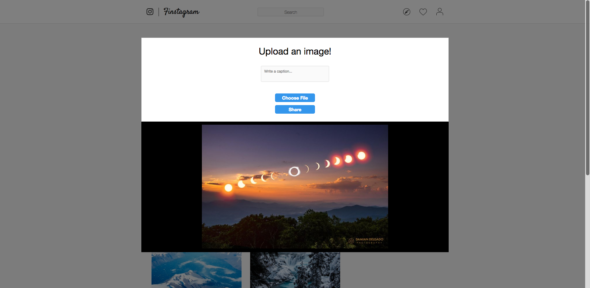
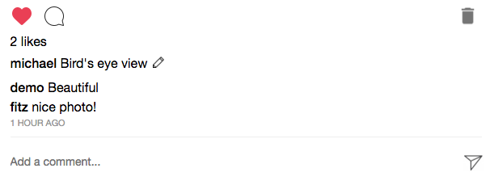

# README

## Live: [Finstagram](https://finstagram-aa.herokuapp.com/#/ "Finstagram")

Finstagram is a fullstack single-page social media web application based on [Instagram](https://www.instagram.com/ "Instagram"). Users can sign up, share photos, and interact with photos other users posted by liking and commenting.


# Feature highlights

## Feed

Finstagram's main feature is being able to share photos and see photos of other users. Once logged in, users are taken to their feed. Users can create posts by clicking on the upload icon on the navigation bar, which immediately updates the feed with the most recent post.


## Profile

Users can navigate to their personal profile by clicking on the profile icon. Their total number of posts is displayed by their username. From there, they may view all of their posts individually, delete posts, create posts through the navigation bar, or navigate back to their feed by clicking on the logo icon.


## Post Create

Clicking on the upload icon opens up a post form, accomplished by rendering a modal component, that includes an optional caption input and a mandatory photo input. Once a file is chosen, the photo is previewed on screen before submission. The optional caption can be editted later by clicking on the edit icon on the post. After submission, users are taken to their feed, which is updated with their new post. Photo storage is handled by Amazon Web Services S3.

Since the profile post view and the post create form both utilize modals, the different modal components are conditionally rendered with a switch statement that checks the modal slice of state. The modal reducer updates the Redux state with either a string value or `null` to indicate which modal to render.

```javascript
let component;
switch (modal.type) {
  case "create":
    component = <PostCreate />;
    break;
  case "postView":
    component = <PostView postId={modal.options.id} closeModal={closeModal} />;
    break;
  default:
    return null;
}
```



Post caption editting is handled by a slice of Redux state that holds either `null` or the `id` of the post caption being editted. This ensures that only a specific post is being editted. When the state holds a post id, a caption edit component is rendered in place of the caption component. On submission of the edit, the state is reverted to null, rendering the updated caption component.

```javascript
let postCaption;
if (captionEditting === post.id) {
  postCaption = <PostCaptionEdit post={post} />
} else {
  postCaption = <PostCaption post={post} />
}
```

## Comments and Likes

Users may like or unlike a photo by clicking on `Be the first to like this`, clicking on the heart icon, or double clicking on the photo. The like count is displayed under each photo. Clicking on the comment icon focuses on the comment input, where a user may post a comment. Hovering over their own comments highlights the comment, allowing deletion by clicking on it.



Comment deletion is handled by a simple condition to check whether the `currentUser` is the owner of a comment. An `onClick` handler function invokes the delete function only when the condition is met.

```javascript
if (comment.commenter_id === currentUser.id) {
  deleteComment(comment);
}
```

# Technologies

Development technologies for Finstagram include React/Redux for the frontend, Ruby on Rails/PostgreSQL for the backend, and Amazon Web Services S3 for file storage.

# Future Implementations

* Search bar to find other users
* Follow feature to personalize feed
* Edit profile and upload profile photo
* Notifications for likes and comments